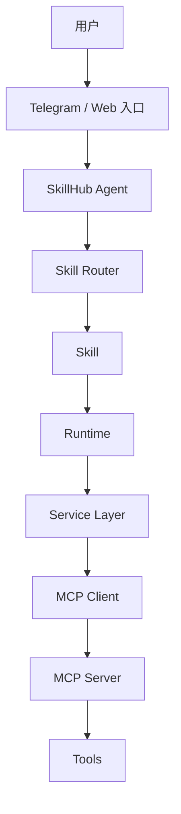
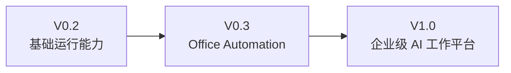

# SkillHub Framework

## 项目简介

SkillHub Framework 是一个面向企业 AI 工作场景的单 Agent、模块化能力框架。核心目标是通过稳定的职责边界统一任务调度、Skill 执行、Runtime 管理、Service 适配和外部工具接入。

当前 Framework 工程位于 [002_SkillHub_Framework_V0.1](./002_SkillHub_Framework_V0.1/)。[001_建筑企业SkillHub](./001_建筑企业SkillHub/) 是首个建筑业务实践项目。

## 项目状态 Dashboard

| 项目 | 当前状态 |
|---|---|
| 当前版本 | `v0.2 Development` |
| 开发状态 | 🚧 开发中 |
| 架构基线 | 🧊 `v0.1-architecture-freeze` |
| 当前重点 | Runtime Layer |
| Framework 模式 | 单 SkillHub Agent |

## SkillHub Framework 架构

核心边界：Agent 只理解、拆解和调度；Router 只分发；Skill 不调用其他 Skill，也不直接访问 Knowledge 或 Tools；Runtime 管理执行上下文与生命周期；Service Layer 负责基础设施适配。

## Architecture Freeze

### V0.1 Architecture Freeze

Tag：`v0.1-architecture-freeze`

冻结内容：

- 🧊 Agent 职责边界；
- 🧊 Skill 规范；
- 🧊 Knowledge 规范；
- 🧊 Tool 规范；
- 🧊 Security 规范。

冻结基线的变更必须遵循 Constitution 和版本管理规范，不得通过局部实现绕过。

## 已完成模块

- ✅ Framework 最小工程骨架；
- ✅ 单 SkillHub Agent；
- ✅ Skill Router 与 BaseSkill；
- ✅ MD + INDEX Knowledge Router；
- ✅ Tool 抽象接口；
- ✅ Constitution 文档体系；
- ✅ V0.1 架构冻结。

## 当前开发任务

### V0.1

- ✅ Framework 骨架；
- ✅ Constitution 文档。

### V0.2

- 🚧 Runtime Layer；
- ⬜ Skill Registry；
- ⬜ Service Layer；
- ⬜ MCP Client；
- ⬜ Config；
- ⬜ Audit。

## Roadmap

## Documentation

### Constitution

- [架构总纲](./002_SkillHub_Framework_V0.1/docs/ARCHITECTURE.md)
- [Skill 规范](./002_SkillHub_Framework_V0.1/docs/SKILL_RULES.md)
- [Knowledge 规范](./002_SkillHub_Framework_V0.1/docs/KNOWLEDGE_RULES.md)
- [Tool 规范](./002_SkillHub_Framework_V0.1/docs/TOOL_RULES.md)
- [编码规范](./002_SkillHub_Framework_V0.1/docs/CODING_RULES.md)
- [安全规范](./002_SkillHub_Framework_V0.1/docs/SECURITY_RULES.md)
- [版本规范](./002_SkillHub_Framework_V0.1/docs/VERSION_RULES.md)
- [开发指南](./002_SkillHub_Framework_V0.1/docs/DEVELOPMENT_GUIDE.md)
- [README 维护规范](./002_SkillHub_Framework_V0.1/docs/README_MAINTENANCE_RULES.md)

### 项目入口

- [SkillHub Framework V0.1](./002_SkillHub_Framework_V0.1/)
- [建筑企业 SkillHub](./001_建筑企业SkillHub/)

## Version History

| 版本 | 状态 | 说明 |
|---|---|---|
| V0.1 | 🧊 已冻结 | Framework 骨架与 Constitution 基线 |
| V0.2 | 🚧 开发中 | Runtime、Registry、Service、MCP、Config、Audit |
| V0.3 | ⬜ 规划中 | Office Automation 能力 |
| V1.0 | ⬜ 规划中 | 企业级 AI 工作平台 |

> README 只维护项目驾驶舱信息。代码变更和 Bug 修复记录由 Git commit 与 CHANGELOG 管理。
